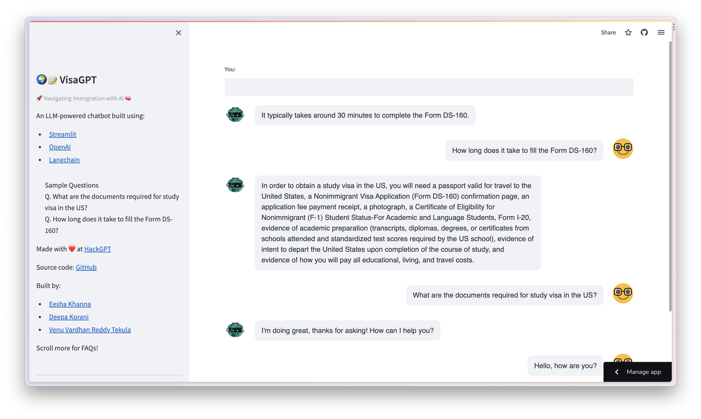

# 🌍📝 VisaGPT

> 🚀 Navigating Immigration with AI 🧠



VisaGPT is an innovative chatbot, built using [Streamlit](https://streamlit.io/), [OpenAI](https://openai.com/) & [Langchain](https://langchain.io/), designed to answer all your immigration-related queries. Utilizing advanced AI technology, VisaGPT guides you through the complexities of immigration processes, offering accurate and up-to-date information on various types of visas, application procedures, necessary documentation, and more. Whether you're planning to study, work, or travel, VisaGPT simplifies your journey by making immigration information accessible and understandable. Navigate the world of visas with ease - VisaGPT is your trusted companion for a stress-free immigration journey.

## Setup

### Prerequisites

- [Python 3.x](https://www.python.org/downloads/)
- [Poetry](https://python-poetry.org/docs/#installation)

### Installation

```bash
$ export OPENAI_API_KEY="<your-openai-api-key>"
$ git clone https://github.com/ek542/visagpt
$ cd visagpt
$ poetry install
$ poetry shell
(.venv) $ streamlit run visagpt/main.py
```

Made with ❤️ at [HackGPT](https://partiful.com/e/WjEpaOg8x6JwdKhHlNXL)

Built by:
1. [Eesha Khanna](https://github.com/ek542)
2. [Deepa Korani](https://github.com/deepakorani)
3. [Venu Vardhan Reddy Tekula](https://github.com/vchrombie)
